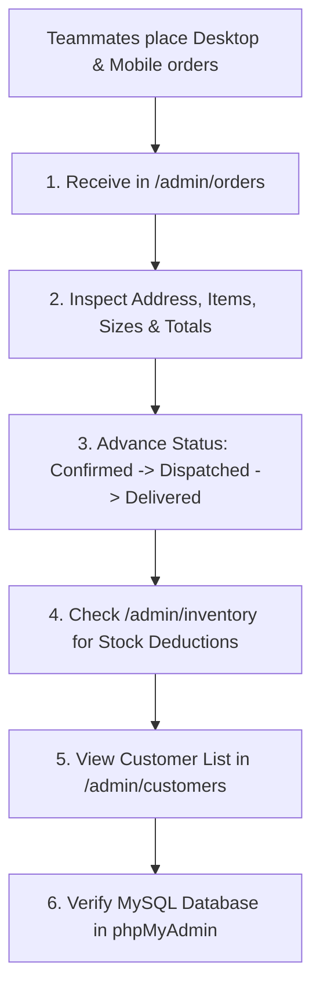

# 👑 QA Testing Guide — Store Administrator & B3 Operations

Welcome to the **HOPO SHOP INDIA** Store Administrator and B3 management guide! As the Master Administrator, your role is to oversee live orders placed by your teammates, manage products and inventory, update order fulfillment stages, create custom coupons, and verify real-time MySQL database transactions.

---

## 🔐 Admin Console Access

- **Admin URL**: 👉 **[https://hopo-shop-bcc.vercel.app/admin](https://hopo-shop-bcc.vercel.app/admin)**
- **Login Page**: 👉 **[https://hopo-shop-bcc.vercel.app/login](https://hopo-shop-bcc.vercel.app/login)**
- **Master Admin Credentials**:
  - **Email**: `admin@hoposhop.in`
  - **Password**: `hopo-admin-2026`

---

## 📋 Step-by-Step Admin Management & Workflow

---

### 1. Real-Time Order Processing (`/admin/orders`)
As soon as **Teammate 1 (Desktop)** and **Teammate 2 (Mobile)** place their orders:
- [ ] Navigate to **Orders (`/admin/orders`)**.
- [ ] Observe the new orders in the table.
- [ ] Click **"View Order Details"** on an order:
  - Inspect the Customer Name, Phone, and Delivery Address.
  - Verify ordered product details: Size (e.g. `M`), Work Type, Quantity, and Subtotal.
  - Check Coupon applied (e.g. `FESTIVE40` discount of ₹2,400).
- [ ] **Advance Order Status**:
  - Change status from `Pending / Placed` ➡️ **"Confirmed & Tailoring"** ➡️ **"Dispatched via BlueDart Luxe"** ➡️ **"Delivered"**.
  - Tell your teammates to refresh their customer `/orders` page or live tracker (`/order-tracking/:id`) to watch the status update in real-time!

---

### 2. Live Inventory & Stock Deductions (`/admin/inventory`)
- [ ] Open **Inventory (`/admin/inventory`)**.
- [ ] Find the products your teammates ordered.
- [ ] **Verification**:
  - Observe that the stock count for the specific size ordered (e.g. Size `M`) has automatically decreased in real-time!
  - Test adjusting stock numbers manually (e.g. replenish stock to 15 units).
  - Test setting stock to `2` units to trigger the **"Low Stock Warning"** badge.

---

### 3. Product Catalog & Image Uploads (`/admin/products`)
- [ ] Open **Products (`/admin/products`)**.
- [ ] View the 32 luxury haute couture products loaded directly from your MySQL database.
- [ ] **Test Actions**:
  - Click **"Edit Product"** on any item to update title, fabric, or base price.
  - Click **"Add New Product"**:
    - Enter Title (e.g. *Royal Emerald Zari Silk Bridal Blouse*), Category, MRP (₹14,999), and Price (₹8,999).
    - Test the **Image Uploader**: Select an image from your computer to upload directly to `api.sribalajicomputers.net/public/uploads/` on your MilesWeb File Manager!
  - Test **"Price Override"** (`/admin/pricing`) to apply a promotional flash price.

---

### 4. Custom Coupon & Banner Management (`/admin/coupons`, `/admin/banners`)
- [ ] Open **Coupons (`/admin/coupons`)**.
- [ ] Click **"Create Coupon"**:
  - Code: **`TEAM50`**
  - Discount: **50% OFF** (or Flat ₹3,000)
  - Minimum Order: ₹3,000
- [ ] **Live Test**: Message Teammate 1 and Teammate 2 with the code `TEAM50` and ask them to apply it in their cart to verify it grants instant discounts!
- [ ] Open **Banners (`/admin/banners`)** to customize the top announcement ticker and home hero slides.

---

### 5. Customer Intelligence & Reports (`/admin/customers`, `/admin/reports`)
- [ ] Open **Customers (`/admin/customers`)**.
- [ ] Verify that Teammate 1 and Teammate 2 appear in the customer roster with their registration timestamps, tier levels, and order tallies.
- [ ] Open **Executive Overview (`/admin`)** and **Reports (`/admin/reports`)** to inspect Gross Sales, Average Order Value (AOV), and conversion charts.

---

### 6. Direct Database Verification (MilesWeb phpMyAdmin)
To double-check the raw records inside MySQL:
1. Open MilesWeb ➡️ Databases ➡️ Click **phpMyAdmin** on `velloreh1_Hoposhop`.
2. Inspect the following tables:
   - **`users`**: View newly registered accounts.
   - **`orders`**: View order rows with order totals, addresses, and delivery statuses.
   - **`order_items`**: View individual product IDs, sizes, and quantities.
   - **`inventory_transactions`**: View the audit log of stock deductions.

---

## 🎯 Admin Summary Checklist
- [ ] Both teammate orders received in `/admin/orders`
- [ ] Order status updated and verified on customer tracker
- [ ] Inventory counts verified
- [ ] Custom coupon `TEAM50` tested
- [ ] phpMyAdmin records confirmed
